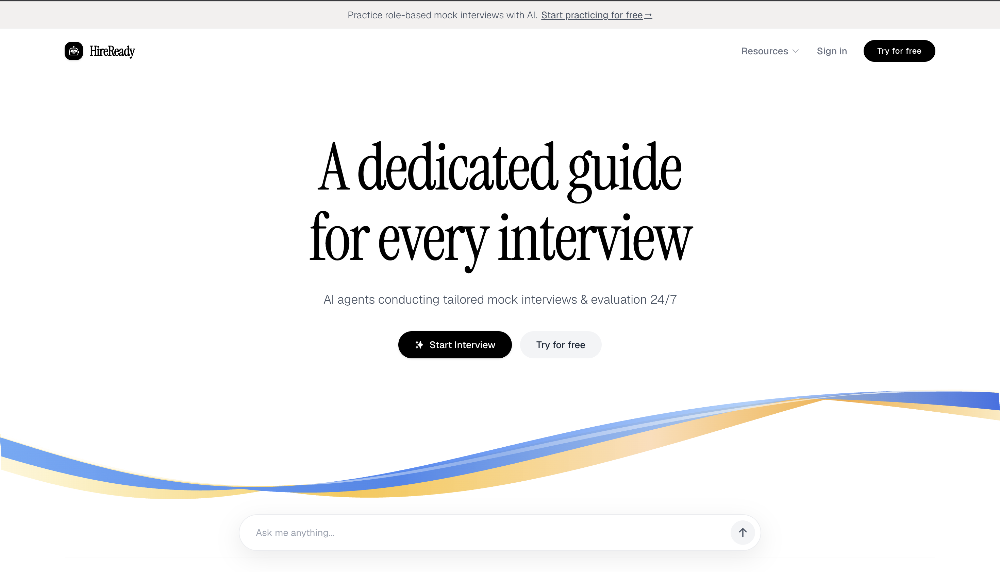

# HireReady — AI Mock Interview & Preparation Platform

HireReady is a premium, state-of-the-art SaaS platform designed to help job candidates prepare for rigorous interview rounds. Powered by advanced AI agents, the platform conducts mock coding, system design, and behavioral simulations, providing detailed feedback reports, resume audits, and grading assessments in real-time.



---

## 🌟 Key Features

### 1. **Interactive AI Chatbot (Holly)**
A stateful, floating chatbot companion sits at the bottom of the interface, providing quick suggestions, answering candidate FAQs, and offering guidance on interview structures dynamically.

### 2. **Three-Pillar Preparation Strategies**
Organized around a modern card grid highlighting our core approach to success:
*   **Speed:** Instant, detailed grading reports in seconds. No waiting for manual evaluator reviews.
*   **Research-Based:** Mock sessions aligned directly with rubrics, patterns, and questions sourced from top-tier tech companies.
*   **Unbiased:** Objective scoring evaluating technical correctness, logic, and delivery without human assessor bias.

### 3. **Dynamic Resume Audit & Prep**
Candidates can audit their resume in real-time:
*   **Skills Extraction:** Scans and highlights identified stacks (React, Node.js, System Design, etc.).
*   **Inline Project Audits:** highlights projects directly in the mockup structure to trace potential weaknesses.
*   **Rubric Matching:** Aligns mock interviews with target company guidelines (e.g., Netflix Leadership Principles).

### 4. **AI Evaluator Console**
An interactive visual panel displaying candidate responses:
*   Includes a live mock code editor displaying code snippets (e.g., Python `Two Sum` solution).
*   Generates grading summary matrices detailing technical depth and communication scores.

### 5. **Premium SaaS Page Themes**
*   **Pricing Plans:** Beautiful light/dark hybrid layout styled with warm-sand neutral backgrounds, radial CSS auroras, and a dark accent card highlighting the *Pro Pack* value tier.
*   **Testimonial Slider:** Stateful feedback carousel smoothly transitioning candidate reviews, roles, and profile headshots.
*   **Interactive Header & Footers:** A responsive Navbar with a toggled Resources dropdown and an updated minimal footer banner with disclaimer structures and adblock-bypassed legal policy routes.

---

## ⚙️ Project Structure

The repository is organized as a monorepo containing:
*   `client/`: Frontend application built with **React**, **Vite**, **Tailwind CSS v4**, **Redux**, **Framer Motion**, and **Lenis Scroll**.
*   `server/`: Backend server running on **Node.js**, **Express**, **MongoDB** (DataBase Connected), **Firebase Admin API**, and **Razorpay SDK** integrations.

---

## 🚀 Setup & Installation

### Prerequisites
Make sure you have [Node.js](https://nodejs.org/) installed on your machine.

### Installation

1.  Clone the repository and navigate to the project directory.
2.  Install dependencies for both the frontend client and the backend server:

```bash
# Install client dependencies
cd client
npm install

# Install server dependencies
cd ../server
npm install
```

### Running Locally

To run the full stack in development mode:

1.  **Start the backend server:**
    ```bash
    cd server
    npm run dev
    ```
    *The server runs on port `6000` by default and connects to the database.*

2.  **Start the frontend client:**
    ```bash
    cd client
    npm run dev
    ```
    *The frontend hot-reloads and serves the app locally at `http://localhost:5173/`.*

---

## 📄 Legal & Compliance
Legal documentation is fully integrated client-side:
*   **Privacy Policy:** Access at `/privacy`
*   **Cookie Policy:** Access at `/cookies`
